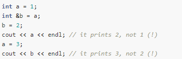
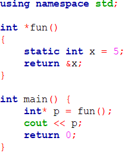

# Cấu trúc dữ liệu động
## Biến tĩnh
- Khai báo tường minh -> Dễ sử dụng !
- Giá trị chỉ tồn tại trong phạm vi khai báo
- Được cấp phát trong stack
- Kích thước không thay đổi: Làm cho bộ nhớ bị lãng phí hoặc thiếu khi có trường hợp phát sinh -> Cần biết trước rõ số lượng maximum để khai báo
## Biến động
- Khai báo không tường mình -> Làm sao sử dụng ?
- Xin khi cần, giải phóng khi sử dụng xong
- Được cấp phát trong heap
## Biến thông thường 
- Các biến có kiểu: int, bool, float, string, char, ...Cách khai báo "auto" là trường hợp ngoại lệ của C++ nó giống từ khóa khai báo bên JavaScript là "var" :v
- Các kiểu dữ liệu có thể chứa > 1 kiểu dữ liệu: queue, set, pair ,stack, ...
## Biến tham chiếu 
- Về mặt hình thức có thể thay bằng từ khóa "define" (tiền xử lí)
- Tạo ra một biến trỏ tới một biến khác, khi một trong hai biến thay đổi giá trị thì biến kia tự thay đổi theo
- Ví dụ:
    
    
## Con Trỏ
- Lưu địa chỉ của một đối tượng DỮ LIỆU KHÁC
- Biến thuộc kiểu con trỏ là biến mà giá trị của nó là địa chỉ của một vùng nhớ ứng với một biến kiểu dữ liệu thông thường hoặc là giá trị NULL.
- Bản thân con trỏ là biến không động !
- Dùng biến con trỏ để lưu địa chỉ của biến động -> dùng con trỏ để truy xuất biến động
- Câu lệnh khai báo con trỏ: <kiểu dữ liệu> * <tên biến>
    <ol type="1">
        <li>Kiểu dữ liệu: void, int, float, string, ...</li>
        <li>Dấu * để cho trình biên dịch biết ta đang khai báo con trỏ</li> 
    </ol>
- Câu lệnh khởi tạo và hủy bỏ:       
    + **malloc** cấp phát bộ nhớ chưa được khởi tạo. (ngôn ngữ C)
    + **calloc** giống như **malloc** nhưng khởi tạo bộ nhớ được cấp phát với một hằng số (0). **malloc** và **calloc** cần được giải phóng với **free**. (ngôn ngữ C)
    + **new** khởi tạo bộ nhớ được cấp phát bằng cách gọi hàm tạo (nếu đó là một đối tượng). Bộ nhớ được cấp phát bằng **new** được giải phóng với **delete**(hàm hủy). (ngôn ngữ C++)
# Vài ví dụ
- Ví dụ 1 
<code>int a = 5;
    int *p = &a; 
    cout << *p; // in ra địa chỉ của biến a</code>

- Ví dụ 2
<code>int a = 5;
    int *p = &a;
    cout << *p; // in ra 5</code>

- Ví dụ 3
<code>int a = 5;
    int *p = &a;
    cout << &(p);// in ra địa chỉ của biến a</code>

- Ví dụ 4
<code>int a = 5;
    int p = *&a;
    cout << p;// in ra 5</code>

- Ví dụ 5
<code>int a = 5;
cout << *&a;  // in ra 5</code>
> Bản thân mình hiểu là: giá trị địa chỉ sẽ là dạng '&' + tên biến. '*' + '&' + tên biến là giá trị biến đó

- Ví dụ 6 

- Ví dụ 7 

- Ví dụ 8: 
Từ khóa "void" làm biến dạng con trỏ     
    + Bản thân biến dùng từ khóa void để làm con trỏ sẽ không được tham chiếu. Khi compile trình biên dịch sẽ không hiểu khi muốn in ra mặc dù khởi tạo sẽ không báo lỗi. Cần ép kiểu là con trỏ mới in ra được
    + Trong thư viện C chuẩn thì không có toán tử tính toán dành cho loại biến này. Tuy nhiên, GNU C cho phép kích thước biến dạng này là 1 byte 
    
    

- Ví dụ 9

> Thông qua tham số là con trỏ,ngoài cách dùng tham biến làm thay đổi giá trị, chúng ta có thể thông qua địa chỉ để làm thao tác này
- Ví dụ 10
Khi hàm trả về dạng con trỏ:

    

#### Từ khóa static 
- Bắt nguồn từ ngôn ngữ C
- Ứng dụng:làm cho giá trị khi thoát khỏi hàm sẽ vẫn giữ nguyên kết quả lần trước và sẽ cộng dồn cho lần sau. Nghĩa là: giới hạn giá trị của biến trong 1 file
- Trong đoạn code trên, nếu không có từ khóa static, chương trình sẽ không in ra được biến p

###### Ví dụ về toán tử new và toán tử delete
- Ví dụ 1 

- Ví dụ 2

- Ví dụ 3

- Ví dụ 4

> Khi truyền dạng object, cú pháp khai báo con trỏ: "tên_Object"*  + "tên_con_trỏ" = new "tên_Object"[số lượng phần tử]
> Không dùng toán tử new với kiểu dữ liệu khác ! 

_**Cập nhật lần cuối: 8/12/2021**_
